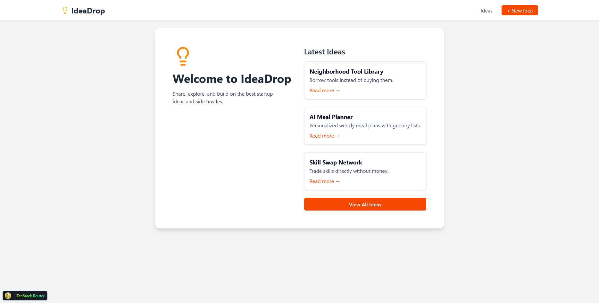
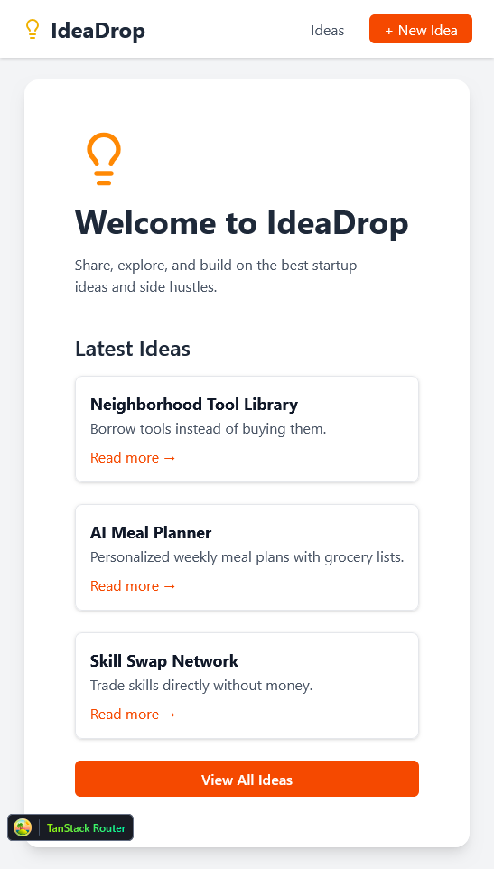

Welcome to your new TanStack app!

# Getting Started

To run this application:

```bash
npm install
npm run start
```

# Building For Production

To build this application for production:

```bash
npm run build
```

## Testing

This project uses [Vitest](https://vitest.dev/) for testing. You can run the tests with:

```bash
npm run test
```

## Styling

This project uses [Tailwind CSS](https://tailwindcss.com/) for styling.

## Screenshots





## Routing

This project uses [TanStack Router](https://tanstack.com/router). The initial setup is a file based router. Which means that the routes are managed as files in `src/routes`.

### Adding A Route

To add a new route to your application just add another a new file in the `./src/routes` directory.

TanStack will automatically generate the content of the route file for you.

Now that you have two routes you can use a `Link` component to navigate between them.

### Adding Links

To use SPA (Single Page Application) navigation you will need to import the `Link` component from `@tanstack/react-router`.

```tsx
import { Link } from '@tanstack/react-router';
```

Then anywhere in your JSX you can use it like so:

```tsx
<Link to='/about'>About</Link>
```

This will create a link that will navigate to the `/about` route.

More information on the `Link` component can be found in the [Link documentation](https://tanstack.com/router/v1/docs/framework/react/api/router/linkComponent).

### Using A Layout

In the File Based Routing setup the layout is located in `src/routes/__root.tsx`. Anything you add to the root route will appear in all the routes. The route content will appear in the JSX where you use the `<Outlet />` component.

Here is an example layout that includes a header:

```tsx
import { Outlet, createRootRoute } from '@tanstack/react-router';
import { TanStackRouterDevtools } from '@tanstack/react-router-devtools';

import { Link } from '@tanstack/react-router';

export const Route = createRootRoute({
  component: () => (
    <>
      <header>
        <nav>
          <Link to='/'>Home</Link>
          <Link to='/about'>About</Link>
        </nav>
      </header>
      <Outlet />
      <TanStackRouterDevtools />
    </>
  ),
});
```

The `<TanStackRouterDevtools />` component is not required so you can remove it if you don't want it in your layout.

More information on layouts can be found in the [Layouts documentation](https://tanstack.com/router/latest/docs/framework/react/guide/routing-concepts#layouts).

## Data Fetching

There are multiple ways to fetch data in your application. You can use TanStack Query to fetch data from a server. But you can also use the `loader` functionality built into TanStack Router to load the data for a route before it's rendered.

For example:

```tsx
const peopleRoute = createRoute({
  getParentRoute: () => rootRoute,
  path: '/people',
  loader: async () => {
    const response = await fetch('https://swapi.dev/api/people');
    return response.json() as Promise<{
      results: {
        name: string;
      }[];
    }>;
  },
  component: () => {
    const data = peopleRoute.useLoaderData();
    return (
      <ul>
        {data.results.map((person) => (
          <li key={person.name}>{person.name}</li>
        ))}
      </ul>
    );
  },
});
```

Loaders simplify your data fetching logic dramatically. Check out more information in the [Loader documentation](https://tanstack.com/router/latest/docs/framework/react/guide/data-loading#loader-parameters).

### React-Query

React-Query is an excellent addition or alternative to route loading and integrating it into you application is a breeze.

First add your dependencies:

```bash
npm install @tanstack/react-query @tanstack/react-query-devtools
```

Next we'll need to create a query client and provider. We recommend putting those in `main.tsx`.

```tsx
import { QueryClient, QueryClientProvider } from '@tanstack/react-query';

// ...

const queryClient = new QueryClient();

// ...

if (!rootElement.innerHTML) {
  const root = ReactDOM.createRoot(rootElement);

  root.render(
    <QueryClientProvider client={queryClient}>
      <RouterProvider router={router} />
    </QueryClientProvider>
  );
}
```

You can also add TanStack Query Devtools to the root route (optional).

```tsx
import { ReactQueryDevtools } from '@tanstack/react-query-devtools';

const rootRoute = createRootRoute({
  component: () => (
    <>
      <Outlet />
      <ReactQueryDevtools buttonPosition='top-right' />
      <TanStackRouterDevtools />
    </>
  ),
});
```

Now you can use `useQuery` to fetch your data.

```tsx
import { useQuery } from '@tanstack/react-query';

import './App.css';

function App() {
  const { data } = useQuery({
    queryKey: ['people'],
    queryFn: () =>
      fetch('https://swapi.dev/api/people')
        .then((res) => res.json())
        .then((data) => data.results as { name: string }[]),
    initialData: [],
  });

  return (
    <div>
      <ul>
        {data.map((person) => (
          <li key={person.name}>{person.name}</li>
        ))}
      </ul>
    </div>
  );
}

export default App;
```

You can find out everything you need to know on how to use React-Query in the [React-Query documentation](https://tanstack.com/query/latest/docs/framework/react/overview).

## State Management

Another common requirement for React applications is state management. There are many options for state management in React. TanStack Store provides a great starting point for your project.

First you need to add TanStack Store as a dependency:

```bash
npm install @tanstack/store
```

Now let's create a simple counter in the `src/App.tsx` file as a demonstration.

```tsx
import { useStore } from '@tanstack/react-store';
import { Store } from '@tanstack/store';
import './App.css';

const countStore = new Store(0);

function App() {
  const count = useStore(countStore);
  return (
    <div>
      <button onClick={() => countStore.setState((n) => n + 1)}>
        Increment - {count}
      </button>
    </div>
  );
}

export default App;
```

One of the many nice features of TanStack Store is the ability to derive state from other state. That derived state will update when the base state updates.

Let's check this out by doubling the count using derived state.

```tsx
import { useStore } from '@tanstack/react-store';
import { Store, Derived } from '@tanstack/store';
import './App.css';

const countStore = new Store(0);

const doubledStore = new Derived({
  fn: () => countStore.state * 2,
  deps: [countStore],
});
doubledStore.mount();

function App() {
  const count = useStore(countStore);
  const doubledCount = useStore(doubledStore);

  return (
    <div>
      <button onClick={() => countStore.setState((n) => n + 1)}>
        Increment - {count}
      </button>
      <div>Doubled - {doubledCount}</div>
    </div>
  );
}

export default App;
```

We use the `Derived` class to create a new store that is derived from another store. The `Derived` class has a `mount` method that will start the derived store updating.

Once we've created the derived store we can use it in the `App` component just like we would any other store using the `useStore` hook.

You can find out everything you need to know on how to use TanStack Store in the [TanStack Store documentation](https://tanstack.com/store/latest).

# Demo files

Files prefixed with `demo` can be safely deleted. They are there to provide a starting point for you to play around with the features you've installed.

# Learn More

You can learn more about all of the offerings from TanStack in the [TanStack documentation](https://tanstack.com).
